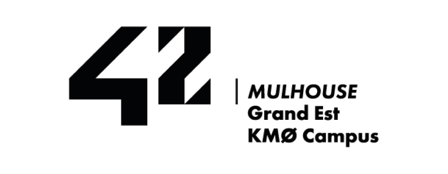
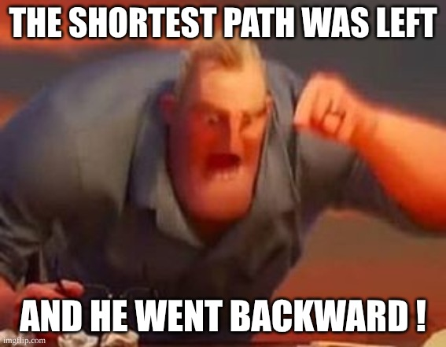

*This project has been created as part of the 42 curriculum by bgix*

# <center>**Fly-In**</center>



 - [Description](#description)
 - [Instructions](#instructions)
 - [Resources](#Resources)
 - [Algorithm](#Algorithm)
 - [Visual Representation](#Visual_Representation)
 - [Input and Output](#Input_and_Output)
## <center>Description</center>

```
Fly-In is a project about file parsing and path finding.
```

<font size=6><center>Parsing</center></font>

```
The parsing is critical, as each cases are expected to # be handled by the code.

Maps have multiples kind of lines:
 - Number of drones
 - Hubs
 - Connection
```

### Number of drones:
```
Relatively simple, the line "nb_drones: x" means the number of drone on the map
```

### Hubs

 ```

 - hub: Exemple_Hub 6 2 [zone=priority color=cyan max_drones=4]

 Hubs are cells that drones can move to, or not if they're blocked.
 ```
 

They have a max number of drone, the base being 1, they can have a zone, amongst:

  - normal: cost 1 turn to move inside.
  - restricted: cost 2 turn to move inside.
  - priority: cost 1 turn to move inside but should be prioritized.
  - blocked: Moving inside is forbidden.

### Connections

```
connection: testing_cell1-testing_cell2 [max_link_capacity=2]
```

Connections are links between two cells, by default they have a drone capacity of one, but with the setting [max_link_capacity=x] it can be changed

# Instructions

To start the project, you must use

```make install```

it will install all nessesary imports inside a venv.
after the download is done, you can use:

```make run MAP=path/to/file.txt```

it will launch a window with the map.

Once the map is done, it will write a log of each turns with the position od each drones.

you can use:

```make clean```

to clean the file back to its first git imported state.

# Resources
 - [pygame's](https://www.pygame.org) web site for pygame.
 - peer to peer.
 - Various niche website about path finding.

# Algorithm

My algorythm is relatively simple.
i calculate all possible paths, sort them from shortest to longest, and assign it to the drones.

The drone will then move along the paths, but before it will check the cell ahead, if it can not enter it will either change path, or wait.

If no path are found that from the start to the end, the program will stops.

# Visual_Representation

The screen make it very easy so see all cells and drones are they are visually visible

# Input and Output

### Input 
 - make run MAP=maps/challenger/01_the_impossible_dream.txt

### Output

 == Turn 36 ==
D17-impossible_goal D18-final_torture5 D19-final_torture4 D20-final_torture3 D21-final_torture2 D22-final_torture1 D23-final_merge D24-conv_restricted9

# Project Meme

